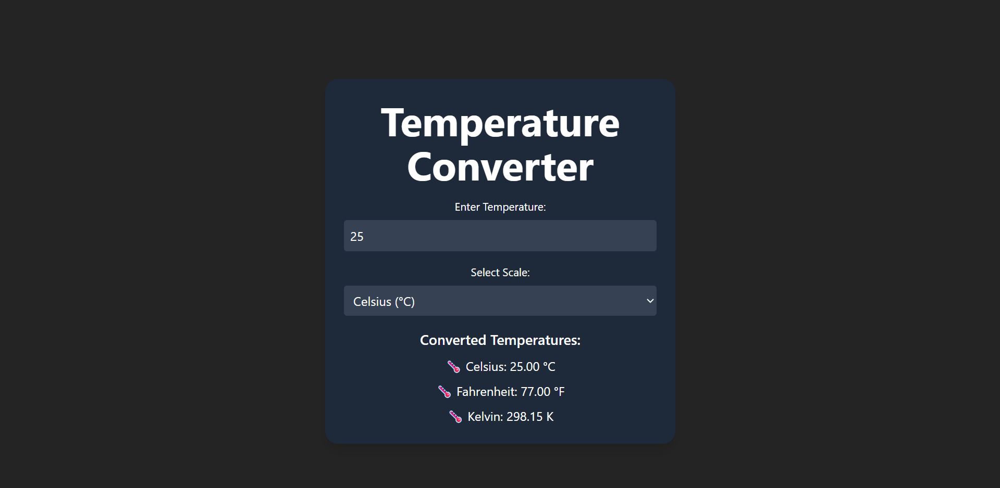

# Temperature Converter 🔥❄️

This is a simple **Temperature Converter** application built using **React** and **Tailwind CSS**. It allows users to convert temperatures between **Celsius**, **Fahrenheit**, and **Kelvin** scales in real-time.

---

## Features ✅

- Convert between **Celsius (°C)**, **Fahrenheit (°F)**, and **Kelvin (K)**.
- Real-time results as the user types.
- Clean and responsive UI with modern design.

---

## Screenshot 📸



---

## How to Run 🚀

1. Clone this repository:

   ```bash
   git clone <your-repository-link>
   cd <project-folder>
   ```

2. Install dependencies:

   ```bash
    npm install
   ```

3. Start the development server:

   ```bash
   npm run dev
   ```
